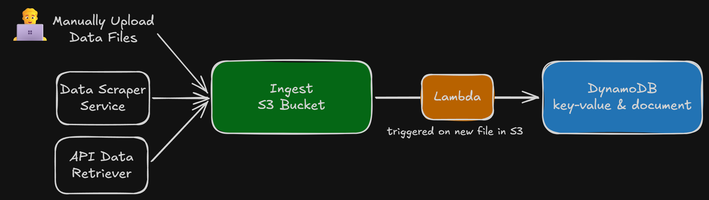
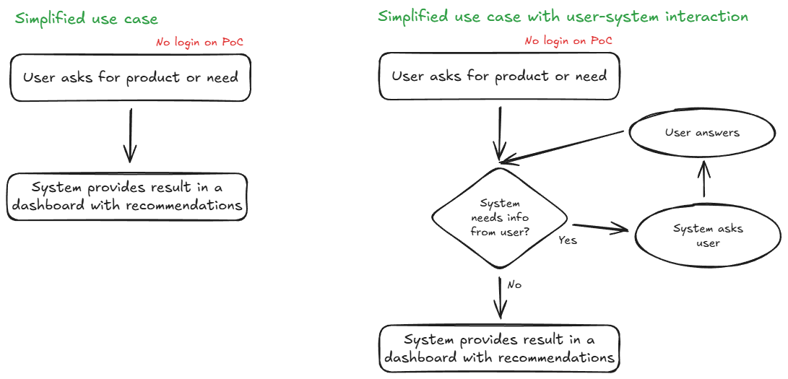

# Architecture Overview: VantageX.ai

The project is moving toward a mostly serverless product experience, and the current scraper pipeline uses **ECS Fargate** for container-based batch execution.

## System Flow

1.  **User Entry:** A user will interact with the **Amplify** frontend.
2.  **Trigger Layer:** Product scraping requests hit **Amazon API Gateway**, which invokes **AWS Lambda**.
3.  **Execution Layer:** Lambda starts an **ECS RunTask** job as a **Fargate task**.
4.  **Scraping Layer:** The scraper container pulls product data from external APIs and writes results to **Amazon S3**.
5.  **Future Intelligence Layer:** The roadmap still targets **AWS Lambda + Amazon Bedrock + DynamoDB** for recommendations and semantic search.

## Current State

- **Implemented:** S3 storage (AES-256 encrypted, public access blocked), ECS cluster (Container Insights enabled), Fargate task definition, Lambda trigger (concurrency-limited), API Gateway endpoint, CloudWatch logging.
- **Planned:** DynamoDB ingestion, Bedrock-based recommendation logic, Amplify frontend integration.

## Infrastructure Diagrams

### System Execution Flow

### Ingest Pipeline

### Retrieval Pipeline

### User Interaction Flow

